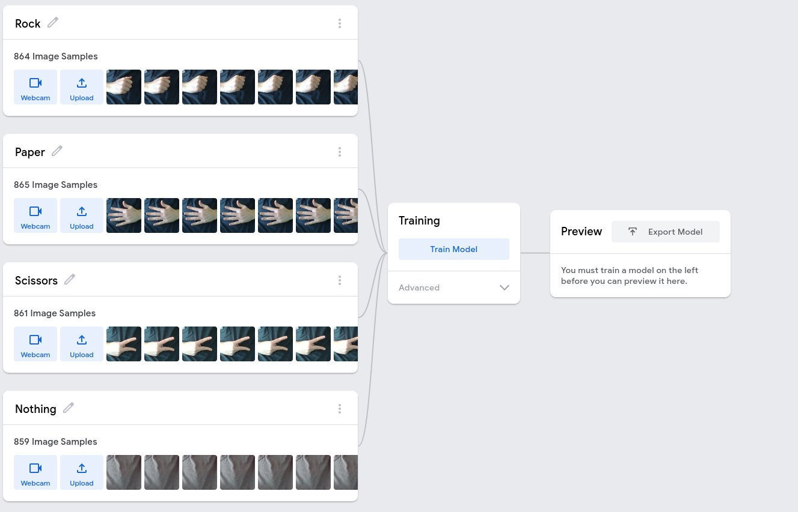
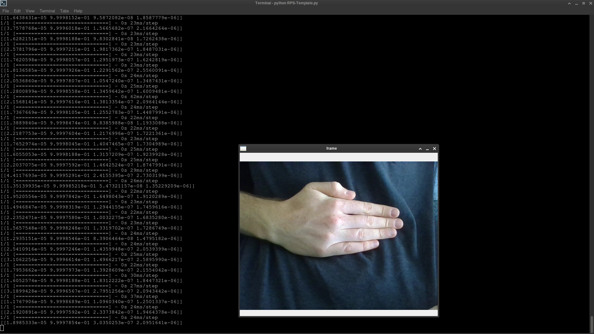
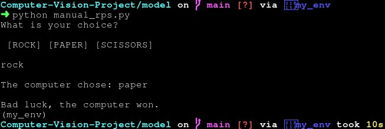
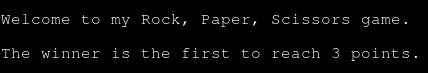
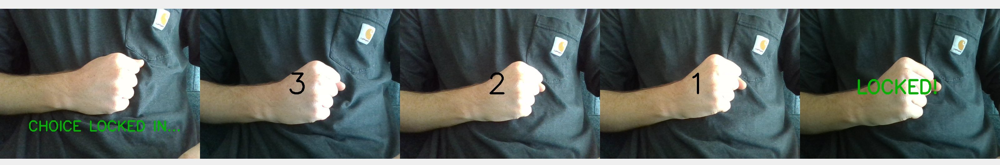
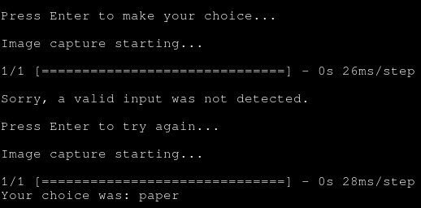
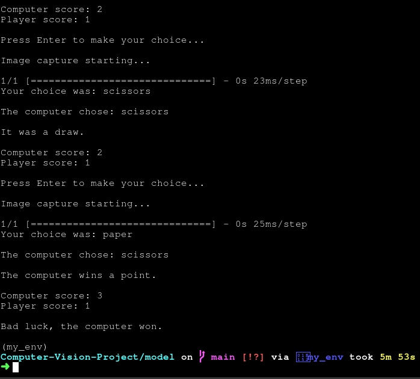

# Computer Vision Project

The task for this project is to create a simple Rock, Paper, Scissors game to be played against the computer, where the player's input is given through the webcam and interpreted by a computer vision model. The computer vision model will be generated by the online Teachable Machine service provided by Google, and the logic of the game will be coded in Python.

# Milestone 1

The task for the first milestone is to generate the model that will be used to interpret the player's input and download it into the local environment. The model should be able to distinguish between the player showing either rock, paper, scissors, or nothing. The online Teachable Machine service is used to generate the model. 



I used approximately 860 training images for each of the data categories, generated by showing the respective symbols in various orientations to the camera with each hand. I pointed the camera at my torso with the signs in front of a plain t shirt to avoid as much extraneous visual information as possible and imrpove on prediction accuracy.

Once the model was generated, its constituent files were downloaded and placed in the `model` folder of this Github repository.

# Milestone 2

The first task for this milestone is to create a new conda conda environment and install in it the necessary libraries to run the model I have generated. I created a new environment called `my_env` and installed in it the libraries `opencv-python`, `tensorflow`, and `ipykernel`. I then exported the list of packages to the file `requirements.txt`.

The next task was to check that the model worked. To do so the file `RPS-template.py` was downloaded and placed in the same folder as the model. When run a window popped up with a feed of the webcam, and an output was continuously given with the the model's prediction of what the feed contained, confirming that the model worked.



In the console you can see that the value with the highest confidence is the second value in the prediction output with about 0.99. This corresponds to paper and so shows that the model is correctly identifying this sign.

# Milestone 3

The task for this milestone was to code a simple rock, paper, scissors game where the user's choice is manually input. The game should randomly select the computer's choice, prompt the player to give an input, calculate the winner, and print a statement saying who won. If the player's choice is not one of rock, paper, or scissors the game will reject it and continue to prompt until a valid choice is given. To do this, I first created two functions: `get_computer_choice` and `get_user_choice`.

```python
import random

def get_computer_choice():
    options = ['rock', 'paper', 'scissors']
    computer_choice = random.choice(options)
    return computer_choice

def get_user_choice():
    valid = False
    while valid == False:
        user_choice = input('What is your choice? \n\n [ROCK] [PAPER] [SCISSORS]\n \n')
        if user_choice.lower() not in ['rock', 'paper', 'scissors']:
            print('Sorry, that is not a valid choice. \n')
        else:
            valid = True
    return user_choice
```

- I imported the `random` module to be able to pick a random item from a list.
- In the body of the `get_computer_choice` function I created a list `options` containing the strings `'rock'`, `'paper'`, and `'scissors'`.
    - I then used the `random.choice` method to select a a random item from this list and assigned it ot the variable `computer_choice`.
    - The function then returns `computer_choice`.
- In the body of the `get_user_choice` I initialise the variable `valid` as equal to `False`.
    - I then create a `while` loop that will continue to run as long `valid` remains `False`.
    - The `input` function is then used to prompt the player and their input is assigned to the variable `user_choice`.
    - If the input is not either `rock`, `paper`, or `scissors` the statement `Sorry, that is not a valid choice. \n` is printed and the player is again prompted to make a choice.
    - Otherwise, the variable `valid` is set to `True` causing the loop to exit.
    - The function then returns `user_choice`

Next I created the function `get_winner` that accepts the arguments `computer_choice` and `user_choice` and returns the winner.

```python
def get_winner(computer_choice, user_choice):
    if computer_choice == 'rock':
        if user_choice.lower() == 'rock':
            winner = 'draw'
        elif user_choice.lower() == 'paper':
            winner = 'user'
        elif user_choice.lower() == 'scissors':
            winner = 'comp'
    elif computer_choice == 'paper':
        if user_choice.lower() == 'rock':
            winner = 'comp'
        elif user_choice.lower() == 'paper':
            winner = 'draw'
        elif user_choice.lower() == 'scissors':
            winner = 'user'
    elif computer_choice == 'scissors':
        if user_choice.lower() == 'rock':
            winner = 'user'
        elif user_choice.lower() == 'paper':
            winner = 'comp'
        elif user_choice.lower() == 'scissors':
            winner = 'draw'
    return winner
```

- In the body of the function `get_winner`a series of `if`/`elif` statements are then used to compare `computer_choice` and `user_choice`.
- If they are the same, the variable `winner` is set to `'draw'`.
- If the computer is the winner, the variable `winner` is set to `'comp'`.
- If the player is the winner, the variable `winner` is set to `'user'`
- The function then returns `winner`.

Finally, I created the function `play` that will run the game by calling the other functions, then output a statement indicating the winner.

```python
def play():
    computer_choice = get_computer_choice()
    user_choice = get_user_choice()
    winner = get_winner(computer_choice, user_choice)
    print(f'\nThe computer chose: {computer_choice}\n')
    if winner == 'draw':
        print('It was a draw.')
    elif winner == 'comp':
        print('Bad luck, the computer won.')
    elif winner == 'user':
        print('Congratulations! The player is the winner.')

if __name__ == '__main__':
    play()
```

- In the body of `play` I call the `get_computer_choice` and `get_user_choice` functions and assign their outputs to `computer_choice` and `user_choice` respectively.
- The `get_winner` function is then called on `computer_choice` and `user_choice` and the output is assigned to `winner`
- The statement `'The computer chose {computer_choice}'` is printed to inform the player of the computer's choice.
- If it was a draw, the statement `'It was a draw.'` is printed and the function ends.
- If the computer is the winner, the statement `'Bad luck, the computer won.'` is printed and the function ends.
- If the player is the winner, the statement `'Congratulations! The player is the winner.'` is printed and the function ends.
- Finally, the `if __name__ == '__main__':` clause is added at the end so that when the file is run the `play` function is called.



# Milestone 4

The task for the final milestone was to integrate the model I have generated with my rock, paper, scissors game code so as to allow the player to make their choice by showing the appropriate sign to the webcam. To achieve this I ultimately settled on using a class based structure as suggested in the extension task for readability and clarity purposes.

I started by creating a new file `camera_rps.py` in the folder `models` containing the generated computer vision model. Within this file I first imported all the necessary modules to run the code before initialising the class `rps`, which takes a single parameter `score_limit`:
```python
import cv2
from keras.models import load_model
import numpy as np
import time
import random

class rps:
    '''
    A game of Rock, Paper, Scissors that randomly generates a choice for the computer and receives the player's input through video capture.
    It starts with a score limit that will cause the game to finish once it is reached.
    '''
    def __init__(self, score_limit=3):
        self.model = load_model('keras_model.h5')
        self.data = np.ndarray(shape=(1, 224, 224, 3), dtype=np.float32)
        self.score_limit = score_limit
        self.computer_score = 0
        self.user_score = 0
        self.options = ['rock', 'paper', 'scissors']
        print('\n'*100 + '\nWelcome to my Rock, Paper, Scissors game.\n')
        time.sleep(1)
        if self.score_limit == 1:
            print(f'The winner is the first to reach {self.score_limit} point.\n')
        else:
            print(f'The winner is the first to reach {self.score_limit} points.\n')
        time.sleep(1)
```

- Within the `__init__` method I defined the following attributes:
    - `model`: The computer vision model that I have generated.
    - `data`: A numpy array that will be populated with visual data from the webcam to be interpreted by the model.
    - `score_limit`: The number of wins required to finish the game, equal to the `score_limit` parameter.
    - `computer_score` and `user_score`: Variables representing the number of wins of the two players, initialised at 0.
    - `options`: A list containing the valid choices players can choose from.
- The statement `Welcome to my Rock, Paper, Scissors game.` is then printed followed by a grammatically correct statement informing the player of the score limit.
- Throughout the game, the `time.sleep()` function is called in between printed statements so as to improve readability of the console output.



---

The next method to define is the `get_prediction` method. The purpose of this method is to receive the player's input through the webcam, use the model to interpret it, and output the model's prediction of the player's choice. While waiting to receive the choice a feed from the webcam is displayed on the screen. A countdown is then shown in the display. Once the countdown is finished the player's choice is locked in and the image capture and feed closes. To achieve the image capture and interpretation I reused large portions of the code from `RPS-Template.py`.
```python
def get_prediction(self):

        cap = cv2.VideoCapture(0)
        labels = ['rock', 'paper', 'scissors', 'nothing']
        print('Image capture starting...')
        start = time.time()
        while True:
            ret, frame = cap.read()
            resized_frame = cv2.resize(frame, (224, 224), interpolation = cv2.INTER_AREA)
            image_np = np.array(resized_frame)
            normalized_image = (image_np.astype(np.float32) / 127.0) - 1
            self.data[0] = normalized_image
            runtime = time.time() - start
            if 1.5 < runtime < 3 :
                cv2.putText(frame, "CHOICE LOCKED IN...", (90,390), cv2.FONT_HERSHEY_SIMPLEX, 1.5, (0,180,0), 3)
            elif 3.5 < runtime < 4:
                cv2.putText(frame, "3", (280,270), cv2.FONT_HERSHEY_SIMPLEX, 3, (0,0,0), 5)
            elif 4.5 < runtime < 5:
                cv2.putText(frame, "2", (280,270), cv2.FONT_HERSHEY_SIMPLEX, 3, (0,0,0), 5)
            elif 5.5 < runtime < 6:
                cv2.putText(frame, "1", (280,270), cv2.FONT_HERSHEY_SIMPLEX, 3, (0,0,0), 5)
            elif runtime > 6.5:
                cv2.putText(frame, "LOCKED!", (180,270), cv2.FONT_HERSHEY_SIMPLEX, 2, (0,180,0), 5)
            if runtime > 6.7:
                prediction = self.model.predict(self.data)
                break
            cv2.imshow('frame', frame)
            if cv2.waitKey(1) & 0xFF == ord('q'):
                prediction = [0,0,0,1]
                break
        cv2.destroyAllWindows()
        cap.release()
        return labels[np.argmax(prediction)]
```
- Within the body of the `get_prediction` method I first initialise two variables:
    - `cap`: The video feed captured through the webcam.
    - `labels`: A list of the labels used by the model in order.
- The statement `Image capture starting...` is then printed in the console.
- The `time.time` function is then used to start a timer since the image capture starts.
- A while loop is then started to keep running until the player's selection is made.
```python
        while True:
                    ret, frame = cap.read()
                    resized_frame = cv2.resize(frame, (224, 224), interpolation = cv2.INTER_AREA)
                    image_np = np.array(resized_frame)
                    normalized_image = (image_np.astype(np.float32) / 127.0) - 1
                    self.data[0] = normalized_image
```
- The first section of this loop is taken directly from `RPS-Template.py`.
- It is used to convert the image received through video capture into the appropriate format to be interpreted by the model.
- This converted image is then used to populate the `data` array.
```python
            runtime = time.time() - start
            if 1.5 < runtime < 3 :
                cv2.putText(frame, "CHOICE LOCKED IN...", (90,390), cv2.FONT_HERSHEY_SIMPLEX, 1.5, (0,0,0), 3)
            elif 3.5 < runtime < 4:
                cv2.putText(frame, "3", (280,270), cv2.FONT_HERSHEY_SIMPLEX, 3, (0,0,0), 5)
            elif 4.5 < runtime < 5:
                cv2.putText(frame, "2", (280,270), cv2.FONT_HERSHEY_SIMPLEX, 3, (0,0,0), 5)
            elif 5.5 < runtime < 6:
                cv2.putText(frame, "1", (280,270), cv2.FONT_HERSHEY_SIMPLEX, 3, (0,0,0), 5)
            elif runtime > 6.5:
                cv2.putText(frame, "LOCKED!", (180,270), cv2.FONT_HERSHEY_SIMPLEX, 2, (0,180,0), 5)
            cv2.imshow('frame', frame)
            if runtime > 6.7:
                prediction = self.model.predict(self.data)
                break
```
- The next section of the loop is used to display a countdown on the feed and interpret the image once the countdown is finished.
- The `time.time` function is used to determine the time since video capture started.
- At timed intervals, the image from the webcam feed is modified to contain text indicating the progress of the countdown.
- The `cv2.imshow` function is then called to show the modified webcam feed to the player.
- Once the countdown is complete, the model is used to interpret the final image and the loop is exited.



```python
        cv2.destroyAllWindows()
        cap.release()
        return labels[np.argmax(prediction)]
```
- The final section of the `get_prediction` method is used to close all video capture and return the model's prediction. 
- The `np.argmax` function is used to find the index of the prediction with the highest confidence.
- This is then used to index the `labels` list and this value is returned.

---

The next methods to define are `get_computer_choice` and `get_user_choice`. These are simply slightly modified versions of the functions from `manual_rps.py`.
```python
    def get_computer_choice(self):
        computer_choice = random.choice(self.options)
        return computer_choice
```
- The `random.choice` function is used to select a random item from the `options` list.
- This selection is then returned.
```python
    def get_user_choice(self):
        while True:
            user_choice = self.get_prediction()
            if user_choice.lower() not in self.options:
                print('\nSorry, a valid input was not detected. \n')
                input('Press Enter to try again...')
            else:
                print(f'Your choice was: {user_choice}\n')
                break
        return user_choice
```
- A `while` loop is started to keep running as long as a valid choice has not been detected.
- The `get_prediction` method is run and its output is assigned to `user_choice`.
- If it is not in the `options` list (i.e the model's prediction is 'nothing') the statement `Sorry, a valid input was not detected.` is output and the player is prompted to try again.
- Otherwise, the statement `Your choice was: {user_choice}` is output and the loop is exited.
- The `get_user_choice` method then returns `user_choice`.



---
Next is the `get_winner` method. As in `manual_rps.py` its function is to compare the outputs of `get_computer_choice` and `get_user_choice` and return who the winner was or if it was a draw. For this I significantly streamlined the version used in `manual_rps.py` to make my code more readable and efficient.
```python
    def get_winner(self, computer_choice, user_choice):
        
        win_matrix = np.array([     ['draw', 'user', 'comp'],
                                    ['comp', 'draw', 'user'],
                                    ['user', 'comp', 'draw']    ])

        winner = win_matrix[self.options.index(computer_choice),self.options.index(user_choice)]
        return winner
```
- I first define the variable `win_matrix`. This is a 3x3 array containing the possible outcomes from all different match ups.
- The y-axis is indexed by the index of `computer_choice` in the `options` list.
- The x-axis is indexed by the index of `user_choice` in the `options` list.
- The value at that position in `win_matrix` is then assigned to the variable `winner` and returned.
---
The final method to define is the `play` method. This is a version of the function from `manual_rps.py` expanded to include the code to repeatedly run rounds until the score limit is reached.
```python
def play(self):
        while True:
            start = input('Press Enter to make your choice...\n')
            if start == 'x':
                break    
            computer_choice = self.get_computer_choice()
            user_choice = self.get_user_choice()
            winner = self.get_winner(computer_choice, user_choice)
            time.sleep(1)
            print(f'The computer chose: {computer_choice}\n')
            time.sleep(1)
            if winner == 'draw':
                print('It was a draw.\n')
            elif winner == 'comp':
                print('The computer wins a point.\n')
                self.computer_score += 1
            elif winner == 'user':
                print('The player wins a point.\n')
                self.user_score += 1
            print(f'Computer score: {self.computer_score}\nPlayer score: {self.user_score}\n')
            time.sleep(1)
            if self.computer_score == self.score_limit:
                print('Bad luck, the computer won.\n')
                break
            if self.user_score == self.score_limit:
                print('Congratulations! The player is the winner.\n')
                break
```
- First a `while` loop is created to keep running until the game is finished.
- The player is prompted to press 'Enter' to input their choice.
- The `get_computer_choice`, `get_user_choice` and `get_winner` methods are then called in that order to determine the two choices and alculate the winner.
- A statement is printed informing the player of the computer's choice.
- If it was a draw, the statement `It was a draw.` is printed and no points are changed.
- If the computer won, the statement `The computer wins a point` is printed and the `computer_score` attribute is increased by one.
- If the player won, the statement `The player wins a point` is printed and the `user_score` attribute is increased by one.
- A scoreboard is then printed to show the current score.
- If the computer's score is then equal to the `score_limit` attribute, the statement `Bad luck, the computer won.` is printed and the loop is exited, finishing the game.
- Otherwise, if the player's score is then equal to the `score_limit` attribute, the statement `Congratulations! The player is the winner.` is printed and the loop is exited, finishing the game.



---
Finally, the `if __name__ == '__main__':` clause is added add the end of the code so that a game is played when the file `camera_rps.py` is run.
```python
if __name__ == '__main__':
    game = rps(score_limit = 3)
    game.play()
```
- An instance of the `rps` class is called with a score limit of 3 and assigned to the variable `game`.
- The `play` method is then called.

# Conclusions

In conclusion this project was a good test of my python abilities as well as an introduction to interacting with machine learning models and some of the torubleshooting required to use them effectively. To improve further on the game I could massively expand my training data set with signs in all manner of environments so as to allow the model to make accurate predictions in a much wider range of circumstances.
